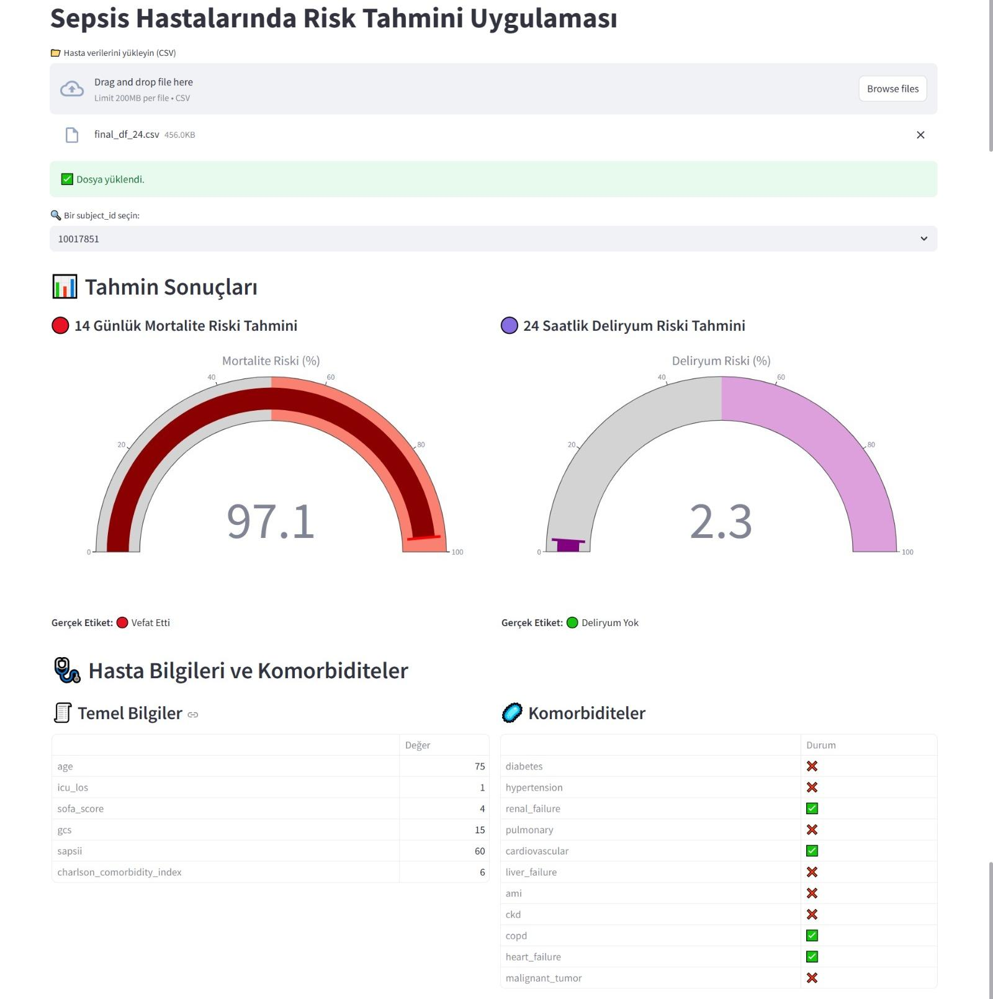

# Sepsis Hastalarında Mortalite ve Deliryum Tahmin Arayüzü

Bu proje, sepsis tanısı almış yoğun bakım hastalarında **14 günlük mortalite** ve **24 saat içinde gelişebilecek deliryum** risklerini tahmin etmek için geliştirilen makine öğrenimi tabanlı bir modelin arayüzüdür. Uygulama, kullanıcının yüklediği hasta verisi (CSV) üzerinden hasta özelinde tahminler üretir ve tahmin sonuçlarını sezgisel grafiklerle sunar.

## Proje Özeti

- Uygulama, daha önce eğitilmiş bir modelle tahmin yapmaktadır.
- Model, verinin %80'i ile eğitilmiş ve kalan %20'si bu arayüzde test verisi olarak kullanılmıştır.
- Eğitim süreci, farklı özellik seçme yöntemleriyle optimize edilmiştir.
- Arayüz, **Streamlit** ile geliştirilmiş olup kullanıcı etkileşimini kolaylaştırmak için **Plotly** grafiklerinden faydalanılmıştır.

> Model eğitimi ve özellik seçimi süreçlerine dair detaylı bilgiler, bu projeye bağlı ayrı bir [model eğitim reposunda](https://github.com/ggulsum/mimic-iv_sad_mortality) bulunmaktadır.

## Uygulama Özellikleri

-  CSV dosyasından hasta verisi yükleme
-  `subject_id` bazlı hasta seçimi
-  Mortalite ve deliryum risklerinin yüzde cinsinden tahmini
-  Gerçek etiketlerle karşılaştırma (Vefat / Hayatta, Deliryum / Yok)
-  Hasta klinik bilgileri ve komorbidite durumu gösterimi
-  Etkileşimli görselleştirmeler (Plotly Gauge Chart)

##  Arayüz Ekran Görüntüsü

